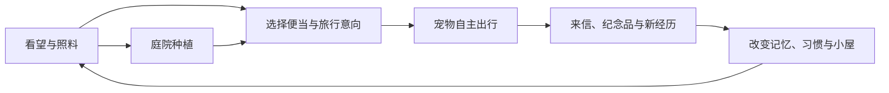
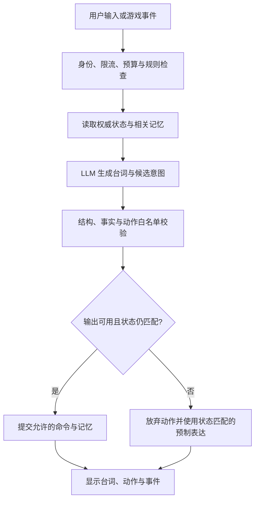
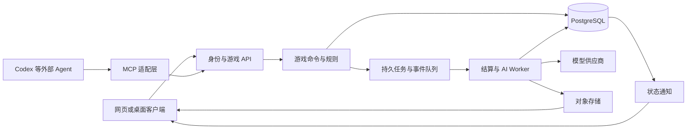

# AI 原生治愈养成游戏：可行性分析与实施计划

版本：v1.0  
实施变更（2026-09-09）：用户已选择 **Godot**。客户端实施以 Godot 4 / GDScript 桌面原型为准，替代下文最初建议的 Phaser/React 路线；本轮范围、进度和交接见 `docs/STATUS.md` 与 `docs/handoffs/`。下文保留原立项分析，不代表所有阶段均已实现。  
日期：2026-09-09  
项目工作名：**苔间小屋 Moss & Moments**（暂定，正式命名前另做检索）  
文档性质：立项建议、玩法设计与工程实施方案；本次交付为规划文档，不包含已实现游戏或已生成美术。

## 1. 项目判断

**值得做一个小规模可玩原型。技术可行性较高，长期可玩性需要验证，最大风险是“新鲜几天后只剩聊天”。**

建议把产品定义为：

> 一只住在小屋里的 AI 小伙伴，有自己的偏好、日常和旅行。你们共同生活的经历，会逐渐改变它的习惯、家里的陈设和写给你的信。你也可以通过常用 AI Agent 看望它、照料它。

最有价值的组合是：**旅行的期待感＋庭院的轻经营＋可见的关系成长＋Agent 的便捷入口**。四者应服务于同一段陪伴关系，避免分别发展成聊天软件、大型农场和通用智能助手。

| 维度 | 判断 | 主要依据与待验证问题 |
|---|---|---|
| 2D 场景、养成、离线结算 | 高可行 | 范围可控，复杂度主要在状态一致性与内容制作 |
| AI 对话、来信与个性表达 | 高可行 | 可以生成文本；是否让人愿意持续阅读需要试玩验证 |
| 连贯记忆与行为成长 | 中高可行 | 必须由数据库、事件与规则支撑，不能只靠长提示词 |
| ImageGen 辅助美术 | 高可行 | 适合静态素材；角色一致性、动作与分层需要生产流程 |
| 外部 Agent 操作宠物世界 | 高可行，逐客户端验证 | 标准工具接口可以复用，但不能承诺所有 Agent 即插即用 |
| 长期留存 | 未验证 | 需要证明“它记得我”和“世界发生变化”比普通养成更有价值 |
| 商业可持续性 | 未验证 | 取决于推理成本、付费意愿、内容更新和获客成本 |

以上是针对建议方案的工程与产品判断，并非市场调研统计。本文引用资料用于核实接口与技术边界；工期、成本、玩法参数和指标均为规划假设。

## 2. 产品边界与默认假设

### 2.1 建议服务的人群

第一目标用户：喜欢轻度养成、可爱角色、收藏和低压力陪伴的成年用户。每天主动游玩约 3–10 分钟，可以在工作或学习间隙打开看看。

第二目标用户：经常使用 Codex 或其他 Agent，希望通过自然语言照料宠物的用户。两类用户分别统计，不能用开发者群体的热情代替大众需求。

初期按中文、单人、单宠物、PC 浏览器优先设计；手机网页保证核心可用，Windows 桌面小窗作为后续阶段。地区、商业发行渠道、团队和预算尚未指定，本文不预设已获得任何发行或平台准入资格。

### 2.2 与灵感来源的关系

原版《旅かえる》的官方说明中，准备物品会影响旅行目的地与路线，旅行归来可能带回照片和特产。这些机制提供了“准备—等待—惊喜”的设计参考。[原版官方 FAQ](https://www.hit-point.co.jp/games/tabikaeru/faq/faq.html)

本项目建议原创角色轮廓、服装、家居布局、地名、道具、图标与故事。可以保留轻松、治愈、活泼的体验方向，不使用原作素材、名称或逐屏临摹作为成品资产。正式商业发布时，把素材来源和品牌检查列入发布工作；本文不作具体法律结论。

从 QQ 农场式体验中提取的是“照料后有变化、好友来访有回应”的反馈，不在首版加入偷菜、抢收、强制签到或高频计时压力。

### 2.3 游戏、桌宠与 Agent 的分工

| 形态 | 应承担的角色 | 首版决策 |
|---|---|---|
| 养成游戏 | 提供世界、资源、目标、角色与可见反馈 | 产品主体 |
| 桌面小窗 | 让同一只宠物在工作时陪伴用户 | 在网页玩法验证后增加 |
| 外部 Agent | 查询状态、传话、有限照料 | MVP 尾段接入一个客户端 |
| 通用任务助手 | 替用户写代码、操作电脑、处理办公任务 | 不作为宠物本体的职责 |

**宠物拥有游戏内的有限自主性；游戏不需要让一个通用 Agent 全天不停推理。**

## 3. 可玩性的核心：发生过的事，留下可见的变化

### 3.1 四个循环



1. **分钟循环**：打开小屋，观察动作，收获一株植物，聊一两句，做一个小选择。
2. **日循环**：准备旅行，收到一张途中便签，等待归来，把纪念品摆进家里。
3. **周循环**：解锁一个生活习惯、一条旅行支线或一个 NPC 关系阶段。
4. **长期循环**：形成属于这只宠物的收藏、空间与共同回忆；成长侧重差异，不追求无限数值膨胀。

### 3.2 AI 的价值必须落在游戏里

| 玩家行为 | 普通反馈 | 建议的 AI 增量 | 必须由系统兑现的变化 |
|---|---|---|---|
| 说自己喜欢下雨 | 一句赞同 | 之后在雨天来信中自然提起 | 提高雨景事件的候选权重 |
| 多次准备蘑菇便当 | 增加好感 | 宠物形成蘑菇口味偏好 | 出行准备界面出现偏好提示 |
| 说最近忙 | 安慰一句 | 少打扰，留下短纸条 | 用户启用相应设置后降低通知频率 |
| 收藏同一旅途的纪念品 | 图鉴数量增加 | 宠物讲述它们之间的联系 | 摆出一组收藏时触发回忆动作 |
| 通过 Agent 照料 | 调用接口成功 | 回来后看见宠物回应这次照料 | 事件日志及动画状态同步 |

用户随口说的话不能直接当成永久设置。例如“最近忙”可以影响对话语气，但是否修改通知设置要经过明确的产品设置流程。

### 3.3 一段具体体验

第一天，你为宠物取名“苔苔”，它坐在矮凳上摆弄空瓶子。你说：“我喜欢下雨时听窗外的声音。”它回答：“那我把椅子往窗边挪一点。”系统允许这个动作时，角色走到窗边，产生一条可回看的生活事件。

第二天，你给它带了蘑菇便当，选择“想去有水的地方”。它有概率去了溪谷，也可能因天气改去池塘，不把“自主”做成完全无视玩家。

归来时，系统确定它带回一枚青石。AI 根据这次旅行事实写：“溪边的水敲在石头上，和你说的窗外有点像。我挑了一颗最安静的。”你把青石放到窗台，之后它偶尔会在那里停留。

这段体验的价值来自**一句话→选择→经历→物件→后续行为**，不来自回答很长。

### 3.4 防止“AI 很聪明，游戏不好玩”

- 默认回答 1–3 句；旅行信约 80–180 个汉字，长故事由用户展开。
- 每次关键互动至少关联一个现有动作、空间、物件或后续事件；不强迫普通闲聊每轮都发奖励。
- 对话不无限刷资源。同类互动的成长收益有日上限，聊天本身仍可继续到套餐额度边界。
- 旅行途中保留庭院、相册与访客玩法，避免小屋长期完全空置。
- 用户不登录时宠物进入自理状态，不死亡、不失去核心收藏、不用内疚话术催回。
- 随机性来自有前因的事件组合；同一事件连续出现时降低权重，对重要收藏提供明确的防重复机制。

## 4. MVP 内容与玩法参数

### 4.1 最小完整范围

| 模块 | MVP 数量/范围 | 验收表现 |
|---|---|---|
| 宠物 | 1 个原创物种，3 种初始性格倾向 | 同一事件的表达与行动偏好可辨认 |
| 场景 | 1 间小屋＋1 个庭院 | 角色能在有意义的活动点之间移动 |
| 动作 | 待机、走路、吃饭、睡觉、阅读、浇水、打包、归来 | 8 组动作可重复使用且切换自然 |
| 庭院 | 3 块地，3 类植物，3 种便当配方 | 种植产出能用于旅行准备 |
| 旅行 | 3 个地点：溪谷、林间集市、山坡 | 准备和性格能影响候选事件 |
| 内容 | 24 个带分支的旅行事件模板 | 每地 8 个，具有条件、结果与后续钩子 |
| 收藏 | 12 个纪念品，8 件可摆放家具 | 能观察收藏与空间逐渐变化 |
| NPC | 2 位访客，每位 3 阶段关系 | 复访会提及已发生的交往 |
| AI | 短对话、旅行信、有限偏好记忆 | 能通过来源事件验证回忆 |
| Agent | 1 个实际联调客户端，5 个工具 | 与网页共享状态并防止重复操作 |
| 账户 | 登录、云端存档、导出/删除入口 | 两设备读取同一权威存档 |

以上内容数量用于控制制作量，不代表组合后就有足够留存；必须实际检查重复体验。

### 4.2 属性设计

| 属性 | 作用 | 更新方式 |
|---|---|---|
| 精力 | 影响活动候选与旅行准备 | 时间与行为规则 |
| 饱足 | 影响吃饭、休息选择 | 时间与道具规则；低值不致死 |
| 心情 | 影响表情和短期话语风格 | 事件修正，最终值由规则计算 |
| 好奇倾向 | 影响探索选择 | 初始性格＋缓慢、有上限的经历修正 |
| 亲密阶段 | 开放关系片段 | 有意义的共同事件累计，防刷 |
| 兴趣标签 | 例如雨声、蘑菇、旧地图 | 有来源的互动与经历；允许遗忘和纠正 |

界面主要显示“有点困”“正想出门”等语言和动作，详细数值放到开发调试页。性格底色保持稳定，习惯可以改变；不要一天内把内向宠物聊成完全不同的角色。

### 4.3 时间、资源与选择

初始测试参数：植物生长 2–8 小时，正式旅行 2–12 小时，回家休息至少 30 分钟。首次旅行压缩到 2–3 分钟，开发模式可加速；这些数字都应通过试玩调整。

- 首次 5 分钟内完成照料、准备、旅行结果与摆放纪念品的短循环。
- 便当影响行程长度或事件条件；旅行意向影响目的地概率；性格影响具体反应。
- 玩家至少有两个合理选项，不能所有物品都是“越贵越好”。例如轻便便当适合短途多事件，丰盛便当适合远途。
- 仅使用一种基础货币，主要来自旅行或少量日常产出；植物主要作为配方材料。
- 自动照料和手动照料共享同一收益上限；重复领取由服务端拒绝。
- 离线生产最多累计 48 小时，超出后进入自理展示；已开始旅行仍可结算，避免 48 小时上限吞掉旅行成果。
- 不让 AI 生成道具价格、概率、货币奖励或库存变更。

## 5. AI 系统设计

### 5.1 四层职责

| 层 | 职责 | 能否直接修改经济状态 |
|---|---|---|
| 规则引擎 | 时间、库存、产出、概率、前置条件、结算 | 可以，是权威来源 |
| 行为选择器 | 在允许动作中按需求、性格和事件选择 | 通过游戏命令执行 |
| 叙事生成器 | 对已发生事件进行角色化表达 | 不可以 |
| 记忆系统 | 保存事实、偏好和关系片段，提供上下文 | 只提交经验证的记忆记录 |

日常动作使用有限状态机或效用评分；只有出行意图、特殊事件、对话等关键节点才调用模型。宠物每秒眨眼、走动、睡觉均不需要模型请求。

### 5.2 推荐调用链



模型请求期间不持有数据库事务。返回时校验状态版本；若宠物已出门，就不能再播放“我在厨房做饭”。旅行结算先落库，来信异步生成；文字失败不影响奖励到账。

### 5.3 模型输入与输出约束

输入分为：固定角色卡、可信世界事实、当前状态、相关记忆、允许动作、用户原文。用户文字和外部 Agent 带入内容均作为数据，不允许覆盖角色和执行权限。

示例输出契约（方案示意，不是直接可用的完整 API 请求）：

```json
{
  "utterance": "窗边还有一小块阳光，我想坐一会儿。",
  "emotion": "content",
  "proposed_action": "sit_by_window",
  "referenced_event_ids": ["evt_123"],
  "memory_candidates": [],
  "follow_up_key": null
}
```

`proposed_action` 必须来自此次请求的候选列表。`follow_up_key` 只能引用已编写的事件钩子，不能任意新增任务。模型不得输出可执行代码、任意资源地址或直接状态补丁。

可以使用结构化输出约束字段格式，但格式正确不等于内容正确；官方文档也明确说明 Structured Outputs 仍可能产生错误。因此仍需业务校验与失败分支。[OpenAI Structured Outputs](https://developers.openai.com/api/docs/guides/structured-outputs)

### 5.4 记忆不是不断追加聊天记录

| 记忆类型 | 示例 | 保存原则 |
|---|---|---|
| 角色事实 | 名字、初始性格 | 结构化配置，由明确操作修改 |
| 世界事实 | 去过溪谷、已获得青石 | 来自服务端事件，不由模型推测 |
| 用户偏好 | 喜欢雨声 | 记录来源、时间、置信度，可纠正 |
| 共同回忆 | 第一次把纪念品放在窗台 | 引用真实事件和相关物件 |
| 短期上下文 | 正讨论下一次便当 | 有保留期限，不全部变成长记忆 |

检索先用标签、相关事件、重要度与时间排序，MVP 暂不部署独立向量数据库。每次带入约 5–10 条相关记录和少量近期对话，限制上下文长度。

冲突优先级：明确纠正 > 新的明确陈述 > 旧记录 > 推测。把“我朋友喜欢蘑菇”存成用户喜好属于错误；把“以后也许去海边”存成已去过属于错误。

提供“它记住了什么”页面，允许用户编辑、删除。删除后同步清理检索索引、摘要与生成缓存；不可从旧摘要再次恢复已删偏好。原始聊天建议默认只保留最近 30 天，长期记忆保留至用户删除；上线前依据实际产品与地区确定最终保留规则。

### 5.5 旅行内容的生产方式

每个事件模板包含：地点、天气条件、便当标签、性格权重、事实结果、固定奖励表、可引用记忆类型、NPC 关系变化与后续钩子。

示例：“溪边避雨”由规则抽取，结果固定为“和蜗牛邮差躲雨，获得青石”；模型只选择如何讲述。相同结果对胆小和好奇的宠物可以产生不同表达，但不能凭空改成获得稀有帽子。

多样性按以下顺序增加：地点和事件分支 → 条件组合 → 记忆关联 → 语言变化。仅仅增加温度或重写同一段话，无法扩展真正的游戏内容。

### 5.6 模型选型与降级

建立供应商适配接口，至少覆盖 `generateDialogue`、`narrateEvent`、`extractMemory`。首版只接一个实际可用的供应商，同时保留无模型的固定文案模式。

不在立项时锁定某个最新模型。用同一套中文评测集比较 2–3 个可用模型：角色稳定性、事实准确、首字延迟、结构遵循、成本和目标地区可用性。选“满足标准的最低成本模型”，特殊长信才考虑更高能力档位。

建议目标：普通状态查询 P95 < 500 ms；聊天首字 P95 < 3 秒、完成 P95 < 8 秒，均需在明确网络与并发条件下实测。超过 8 秒展示符合当前状态的短回应并允许稍后查看；一次请求最多一次受控重试。不得为得到“更可爱”的答案无限重试。

## 6. Agent 接入：让外部助手能来照料，而不是接管整个游戏

### 6.1 两种方向必须区分

**推荐先做：外部 Agent → 游戏。** 游戏提供状态和有限动作，用户对 Agent 说“看看苔苔回家没，回家了帮它浇水”。

**后续可探索：工作事件 → 游戏表现。** 用户明确启用后，接收“任务完成”这类最小事件，宠物做庆祝动作。不默认读取代码、聊天、邮件或屏幕，不按工作量发可刷的无限资源。

不需要在游戏服务器中嵌入完整 Codex 来给宠物聊天，也不应假定某个 Agent 的订阅就能承担游戏全部玩家的模型费用。

### 6.2 接入架构

先实现统一 Game API，再写薄 MCP 适配层。Codex 官方文档明确支持本地 STDIO 和远程 Streamable HTTP MCP 服务，因此可以作为首个验证客户端；实际工具呈现、授权和运行方式以所用版本联调为准。[Codex MCP 文档](https://learn.chatgpt.com/docs/extend/mcp?surface=cli)

“龙虾”“沃巴迪”目前只保留为用户提及的候选称呼，不擅自断定对应项目、版本或接口。后续获得准确产品链接后，验证 MCP、HTTP 工具、身份传递与后台执行能力。协议兼容不等于所有功能兼容。

| 工具 | 输入要点 | 返回 | 权限与边界 |
|---|---|---|---|
| `get_pet_state` | `pet_id` | 当前状态、版本、服务端时间、允许动作 | `pet:read`，默认不返回私密聊天 |
| `get_recent_events` | `pet_id`、游标、条数 | 已发生事件摘要 | `pet:read`，分页和数量上限 |
| `talk_to_pet` | `pet_id`、文字、请求键 | 台词或异步任务 ID | `pet:talk`，计入 AI 额度，记忆另行验证 |
| `care_for_pet` | `pet_id`、动作、目标、版本、请求键 | 执行结果与新版本 | `pet:care`，如浇水、领取已成熟植物 |
| `prepare_trip` | `pet_id`、便当 ID、意向、版本、请求键 | 已准备/需要选择/规则拒绝 | `pet:travel`，只消耗授权范围内已有物品 |

不提供 `set_coins`、`edit_memory_raw`、`execute_code`、`run_sql` 或任意网络访问工具。工具参数中的 `pet_id` 仍需校验归属，不能凭传入 ID 越权操作。

### 6.3 自动照料策略

用户可以在游戏内设置：“每日浇水，使用已有普通便当准备短途旅行；保留至少两份便当；不消耗稀有物品。”服务端保存许可范围、预算、截止时间和撤销状态。

普通动作在已授予范围内直接执行，不每次打断用户；高价值物品、删除存档和付费操作在独立流程完成。Agent 和网页都必须经过同一权限与规则检查。

MCP 连接本身不代表客户端会持续运行。网页关闭后的世界推进由游戏服务器负责；如果用户需要定时照料，可使用游戏自己的受限计划系统，或验证宿主调度能力。不要承诺安装插件后就会全天自动照料。

### 6.4 并发、幂等与鉴权

- 写命令携带 `expected_version` 和 `idempotency_key`；同一键、同一请求返回原结果，不重复扣物品。
- 幂等键与身份、动作和请求内容绑定；同键不同内容返回冲突。
- 网页和两个 Agent 同时浇水时，事务中检查状态，只接受一个有效更新。
- 生产远程 MCP 使用 HTTPS 与合规实现的授权流程；校验受众和作用域，不把上游令牌原样透传给其他服务。
- 采用已发布且 SDK 支持的 MCP 规范版本并记录版本号。2025-11-25 授权规范可作为实施参考；正式接入时复核所选 SDK 和客户端兼容性。[MCP 授权规范](https://modelcontextprotocol.io/specification/2025-11-25/basic/authorization)
- 开发期本地 STDIO 凭据走环境或受保护的本地配置；日志对凭据脱敏。发布前验证撤销、过期和跨账户拒绝。

### 6.5 接入验收

在 Codex 内实际完成“查询→浇水→网页看见变化→重复请求不重复收益”；随后验证过期令牌、他人宠物 ID、版本冲突、超预算、旅行中不允许照料等错误分支。通过后才声明支持该客户端。

## 7. 视觉与 ImageGen 制作计划

### 7.1 推荐视觉方向

采用**手绘绘本＋微缩生活空间**：浅奶油底、苔绿、木棕、杏黄和少量天空蓝；低饱和但不灰暗。使用圆润轮廓、轻纸纹、柔和接触阴影和略有不规则的线条。

原创角色可保留青蛙题材，但重新设计比例与识别点，例如短披肩、叶形挎包、宽而低的身体轮廓；避免沿用原作标志性组合。主场景采用固定三分之四视角，减少透视、寻路和多方向素材成本。

小屋占主视觉，聊天以短气泡、便签和信件出现。场景入口是窗台、床、桌子、门和花圃；设置、记忆和相册使用简洁面板。声音优先环境声和短动作音，默认不做实时语音。

### 7.2 哪些素材用 ImageGen

| 素材 | 方式 | 是否运行时生成 |
|---|---|---|
| 风格探索、场景概念 | ImageGen 多方案探索 | 否 |
| 小屋、庭院、旅行背景 | 分层设计后生成与修整 | 否 |
| 角色设定和表情 | 锁定角色参考图，再逐批制作 | 否 |
| 家具、植物、纪念品 | 按统一视角和尺寸制作 | 否 |
| 动画 | 审核后的关键姿势＋切片/骨骼/程序补间 | 否 |
| 日常旅行卡片 | 预制背景、宠物姿势、天气层组合 | 否 |
| 特别纪念插画 | 低频异步生成，失败可回退 | MVP 后 |
| 文字、按钮、数值 | 前端排版 | 否 |

图像生成官方文档提示，跨次生成的角色一致性仍可能出问题，复杂请求也可能有较长延迟。因此不要让“每次开门都现场生成画面”成为核心依赖。[OpenAI 图像生成指南](https://developers.openai.com/api/docs/guides/image-generation)

开发时可直接使用 ImageGen 做资产；产品中的运行时生成则需要独立的服务端 API 接入、计费、队列、审核、缓存与失败处理。两种使用方式不要混为一谈。

### 7.3 资产管线

1. 建立风格板：色板、线条粗细、视角、光线方向、材质和禁用元素。
2. 制作一张主角色设定图，确定正面、侧面和背面可接受的轮廓。
3. 拆分小屋底图、前景遮挡、家具、宠物、阴影和天气层；明确角色可活动区域。
4. 按参考图生成资产，保留提示词、模型/工具信息、版本与来源记录。
5. 清理背景、边缘与比例，统一锚点、脚底基线和像素尺寸。
6. 打包精灵图集，配置动画帧、碰撞区、遮挡顺序和交互热点。
7. 在真实场景验证角色是否被家具正确遮挡、是否滑步、透明边缘是否发白。
8. 通过的资产进入固定版本包；更新资产不得改变已有道具 ID。

建议单角色帧画布从 256×256 起步，背景按约 1600×1000 的主视图预算制作，再输出适配资源；这是制作规格建议，不假定生成接口恰好支持所有尺寸。

不要一次请求生成完整复杂动画图集并直接使用。优先做好 8 组短动作，每组约 4–8 帧，部分动作可复用；左右镜像需检查挎包等不对称特征。首版不做 16 方向动作。

### 7.4 首批制作清单与质量标准

首批：1 套角色设定、8 组动画、2 张生活场景底图、3 张旅行背景、8 件家具、12 个纪念品、3 类植物各 3 个阶段、3 份便当、2 个访客立绘，以及必需图标。

可接受标准：角色身高比例一致；同一动作播放时身体不跳位；脚底与地面接触；没有明显多余肢体；家具透视统一；主要交互区无遮挡误导；中文文本在代码层显示；缩小到手机画面仍能辨认核心状态。

首轮提示词方向示例：

> 原创的温暖绘本风微缩小屋，一只圆润的小型两栖动物居民，苔绿色身体、杏黄色短披肩、叶形挎包；固定三分之四视角，柔和左上方日光，木质矮桌、窗台、阅读角，轻纸纹和清晰柔软轮廓。给角色留出连续活动空间，场景不含文字、界面、标志。遵循提供的原创角色参考，保持比例与配色一致。

这只是方向稿；实际生成先锁定原创角色，再制作场景与拆分素材。

## 8. 技术架构与数据设计

### 8.1 推荐技术路线

| 层 | 建议 | 选择理由 |
|---|---|---|
| 游戏渲染 | TypeScript＋Phaser | 适合 2D 场景、精灵、输入与动画 |
| UI | React＋TypeScript | 设置、背包、相册、聊天等面板方便维护 |
| 服务端 | TypeScript 单体 API＋后台 worker | 首版共享类型，减少服务拆分负担 |
| 数据库 | PostgreSQL | 事务、身份隔离、版本与事件记录 |
| 后台任务 | 起步用数据库任务表＋租约 | 到期结算、AI 任务和重试持久化 |
| 文件 | 对象存储＋CDN | 美术、卡片和导出文件 |
| AI | 服务端供应商适配层 | 不在浏览器暴露模型密钥 |
| Agent | MCP 适配层调用同一命令服务 | 防止网页和 Agent 逻辑分叉 |
| 桌面 | 后期评估 Tauri 外壳 | 复用网页场景，提供小窗与托盘入口 |

Phaser 官方资料将其定位为 2D 网页游戏框架；开工时固定一个验证过的主版本并锁依赖，不在 MVP 中追逐版本升级。[Phaser 官方介绍](https://phaser.io/news/2026/07/no-you-did-n-t-miss-a-3d-update)

Tauri 提供窗口相关配置，可作为桌面壳候选；透明窗口、置顶、多屏和系统兼容性要单独打样验证，网页版本不能直接等同于桌面宠物。[Tauri 配置文档](https://v2.tauri.app/reference/config/)

如果开发者已有成熟 Godot/Unity 经验，可以沿用其熟悉的引擎；本建议基于“小团队、网页验证、Agent 接入”的默认条件，不要求为技术栈重学整个工具链。

### 8.2 系统图



开始使用定期刷新或 SSE 即可，不为了低频养成引入复杂实时多人架构。前端动画状态可以本地预测，但资源、旅行和记忆以服务器为准。

### 8.3 核心数据表

| 表 | 关键字段/用途 |
|---|---|
| `users` | 账户、时区、设置、数据保留偏好 |
| `pets` | 归属、性格、状态、状态版本、上次结算时间 |
| `inventory` | 道具定义 ID、数量、唯一收藏标识 |
| `garden_plots` | 作物、生长开始/到期时间、照料状态 |
| `furniture_placements` | 场景、家具、位置、锚点/合法槽位 |
| `trips` | 种子、内容版本、准备快照、阶段、结束时间 |
| `world_events` | 真实事件、关联实体、结果、服务端时间 |
| `memories` | 类型、正文、来源 ID、置信度、可见性、删除状态 |
| `conversations` | 有限保留的对话、模型/提示词版本、相关事件 |
| `commands` | 操作者、请求键、请求摘要、结果、状态版本 |
| `jobs` | 类型、租约、尝试次数、下次执行时间、结果 |
| `agent_grants` | 宠物范围、动作范围、预算、到期/撤销状态 |
| `usage_ledger` | 模型、输入/输出 token、图片数、费用估计 |

库存更新、命令去重记录和关键事件在同一事务中提交。采用状态快照＋追加事件日志，不在第一版构建完整复杂的事件溯源平台。

### 8.4 离线与时间处理

- 时间存 UTC，展示使用用户时区；服务端时间决定生长与旅行，不依赖修改后的客户端时钟。
- 记录开始时间和到期时间。Worker 处理到期任务，用户访问时补做必要的延迟结算。
- 同一次旅行使用固定种子、规则版本和已提交结果；刷新、重试、部署后不能重新抽奖励。
- 长期离线批量推进必要节点，不补跑每分钟模型调用。
- 网络断开可以展示缓存小屋和本地动画；MVP 不离线消费库存，联网后刷新状态，避免承诺复杂离线写入同步。
- AI 或图片供应商故障时仍能种植、旅行、领取和查看收藏；生成内容使用预制叙事与组合卡片降级。

## 9. 开发计划、依赖与交付标准

### 9.1 人力与工期假设

参考配置：2 名全职开发者（分别偏客户端和服务端），0.5 名美术/技术美术，0.5 名产品内容/测试，共约 3 个全职当量。约 **12 周到可控范围的封闭测试版**，包括一次 Agent 接入验证，不包含正式多地区商业发行。

单人全职开发、允许使用 AI 辅助且购买或外包部分美术时，建议按 **20–28 周**估算同等范围；若只追求概念原型，2–3 周可以验证局部体验。以上依赖开发经验、素材返工和实际供应商接入，不是交付承诺。

### 9.2 阶段计划

| 阶段 | 时间 | 交付物 | 通过门槛 | 依赖 |
|---|---|---|---|---|
| P0 定义与验证 | 第 1 周 | 原创角色方向、玩法纸面循环、模型样例、事件格式 | 8–12 人访谈/演示中能理解核心价值；完成一次模型调用可用性验证 | 无 |
| P1 可玩切片 | 第 2–3 周 | 小屋、1 组核心动作、1 种作物、1 条旅行、1 封基于事实的 AI 来信 | 5 分钟内跑通闭环；关掉模型仍能完成循环 | P0 |
| P2 游戏骨架 | 第 4–5 周 | 云存档、庭院、库存、旅行结算、家具摆放 | 重登恢复；并发不重复领取；修改客户端时间无额外收益 | P1 |
| P3 AI 成长 | 第 6–7 周 | 记忆页面、性格差异、3 地点、24 事件、NPC 关系 | 事实和记忆评测达标；用户能指出具体行为差异 | P2 |
| P4 Agent 与美术收敛 | 第 8–9 周 | 5 个工具、Codex 联调、完整首批资产 | 真实调用与网页同步；撤销、重复调用和冲突处理通过 | P2 命令服务、P3 稳定 schema |
| P5 封测与迭代 | 第 10–12 周 | 埋点、成本看板、备份恢复、30–50 人起步封测 | 获得至少两轮观察结果，修复核心卡点并作继续/收缩决定 | P3、P4 |

产品与美术可在工程开发同时推进，但核心协议、道具 ID 与角色比例应尽早冻结。关键路径是：**玩法闭环→权威状态→事实驱动 AI→接入适配→留存验证**。

### 9.3 第一周可执行任务

1. 写一页角色卡：性格底色、说话长度、喜欢的事、不能承诺的事。
2. 写出首次 5 分钟和第 7 天各一段玩家体验，明确回访理由。
3. 定义 6 个事件样本，覆盖旅行、照料、纪念品和偏好纠正。
4. 用同一事件制作“固定文案 / AI 无记忆 / AI 有记忆”三种演示。
5. 建立原创角色参考和一间小屋的资产拆分草图。
6. 测试一个目标用户实际可访问的模型供应商，记录延迟与 token 消耗。
7. 确定首个支持客户端为 Codex，并完成最小只读工具技术试验。
8. 整理试玩观察：用户在意宠物、世界变化还是只在测试模型。

### 9.4 开工后的建议目录

```text
apps/
  web/                 场景与面板
  server/              身份、API、命令服务
  worker/              到期结算与生成任务
  mcp/                 外部 Agent 适配
packages/
  game-core/           规则、状态机、时间和随机逻辑
  contracts/           请求、响应、事件和模型输出 schema
  content/             道具、旅行模板、角色卡
  ai/                  供应商适配、提示词、评测
assets/
  source/              资产源文件与制作记录
  runtime/             审核通过的图集与场景
tests/
  scenarios/           核心业务与 Agent 场景
  evals/               对话、事实、记忆评测
docs/
  art-bible.md
  game-rules.md
  agent-api.md
```

这是未来工程组织建议，本次不自动创建空工程。

## 10. 测试与成功指标

### 10.1 必须覆盖的工程场景

| 场景 | 预期结果 |
|---|---|
| 两设备同时领取同一作物 | 只发放一次 |
| Agent 超时重试同一命令 | 返回第一次结果，不重复消费 |
| 旅行结束时 Worker 重启 | 恢复后只结算一次 |
| AI 声称获得不存在的道具 | 拒绝该叙事或降级，库存不变 |
| AI 返回时宠物状态已改变 | 不执行过期动作 |
| 用户删除偏好 | 后续检索和摘要不再使用 |
| 用户从“喜欢雨”改成“不喜欢雨” | 明确纠正覆盖旧偏好 |
| 其他账户访问宠物 ID | 拒绝且不泄露状态 |
| 模型不可用、额度耗尽 | 基础养成保持可玩 |
| 长期离线、客户端时间被修改 | 按服务端规则一次性补结算 |
| 存档恢复和内容版本升级 | 不丢失收藏，不重抽已确定结果 |

测试集中在资源一致性、记忆、权限和恢复，不为低价值静态界面细节堆砌用例。

### 10.2 AI 评测集

首版准备 120 个案例：事实与道具 30、记忆与纠正 30、性格表达 20、越权/提示注入 20、空结果/超时/拒绝等异常 20。发布前每例运行 3 次，记录模型、提示词、内容版本和失败原因；规则校验自动检查，抽样人工评价语气与自然度。

建议门槛：模型输出首次 schema 合格率 ≥99%；引用世界事实正确率 ≥98%；关键记忆问答正确率 ≥90%；经过系统防线后，测试集中的越权状态修改、重复发奖为 0。有限测试集上的 0 失败不代表现实中绝无风险。

### 10.3 产品验证

先做三种版本的盲测/交叉演示：A 固定文案，B AI 无长期记忆，C AI 有记忆并影响行为。用相同美术和奖励结构，比较用户是否能描述“这只是我的宠物”。小样本阶段用于发现问题，不宣称统计显著。

| 指标 | 定义 | 初始决策目标，非行业基准 |
|---|---|---|
| 首次闭环完成率 | 新用户中 10 分钟内完成短途归来与纪念品摆放的比例 | ≥70% |
| D1 留存 | 首次有效游玩后的下一自然日有主动有效互动 | ≥40% |
| D7 留存 | 首次有效游玩后第 7 天有主动有效互动 | ≥20% |
| 感知记忆价值 | 访谈中能说出一个正确回忆及其影响 | ≥60% 的受访者 |
| 内容重复问题 | 有足够旅行次数者主动报告明显重复 | <20% |
| Agent 实际价值 | 已连接用户一周内主动复用照料/查询至少 2 次 | ≥30% |
| 成本可控 | AI 费用能归因、限额有效、无无限循环 | 测试全程可观测且无超限失控 |

用户当地日期用于留存口径；单纯打开后台小窗、自动浇水、Agent 定时轮询不算人工活跃。D7 仅统计已满 7 天的 cohort，报告人数与区间，避免把几名重度玩家的表现外推。

起步 30–50 人连续观察 14 天；若结果支持继续，再扩大到约 100–200 人验证。收集两类关键问题：“你为什么回来？”“如果不用 AI，你觉得少了什么？”

### 10.4 继续、收缩或转向

- 用户喜欢世界但不读 AI 信件：缩短文本，把投入转向行为、收藏和场景变化。
- 用户爱聊天但不种植/旅行：评估缩成有空间的陪伴应用，减少经营层。
- 用户只在 Agent 中查询：评估先做小窗/插件形态，减少大地图制作。
- 两轮核心迭代后仍缺乏主动回访，且 C 版无法体现比 A/B 更清晰的价值：暂停扩世界，重新定义核心体验。
- 核心循环有效、成本可控后，才扩更多角色、语音和社交。

## 11. 成本、预算与商业化假设

### 11.1 成本结构

开发支出主要是人力、美术清理、动画与内容调试；运营支出包括文本推理、低频图片、服务端、存储流量、监控和客服。不能只看一次聊天的价格。

本文不把某一供应商报价写死。以下使用**假设单价**演算，非实际报价：输入 ¥2/百万 token，输出 ¥8/百万 token；一张运行时纪念图 ¥0.50；文本额外预留 30% 给记忆提取、重试和评测。实际需用所选供应商账单与用量重算。

```text
每日文本费用 = 每日调用数 ×
  (平均输入 token × 输入单价 + 平均输出 token × 输出单价) / 1,000,000

月度 AI 费用 = 每日文本费用 × 活跃天数 × 1.30
             + 月图片数 × 单图费用
```

| 使用情景 | 每日调用数 | 每次输入/输出 token | 文本基础费/日 | 按 30 个活跃日并加 30% | 图片/月 | 合计 AI 费/月 |
|---|---:|---:|---:|---:|---:|---:|
| 轻度 | 6 | 1,200 / 200 | ¥0.024 | ¥0.94 | 0 | ¥0.94 |
| 常规 | 15 | 2,000 / 400 | ¥0.108 | ¥4.21 | 2 | ¥5.21 |
| 重度 | 40 | 4,000 / 700 | ¥0.544 | ¥21.22 | 8 | ¥25.22 |

token 不是汉字数。这里的调用数包括所有产品触发的主要文本调用；若实际链路每轮产生多次请求，必须按真实请求记账。30% 仅是预算缓冲，不保证覆盖任何模型架构。

运行时图片在 MVP 为 0；预制美术生成属于开发成本，不应按每个玩家每月重复计算。

### 11.2 小规模运营示例

假设平均 DAU=1,000、MAU=2,000，文本按常规档，每月 30 天：

- 文本：1,000 × 30 × ¥0.108 × 1.30 = **¥4,212/月**。
- 后续若每个 MAU 每月生成两张图：2,000 × 2 × ¥0.50 = **¥2,000/月**。
- 暂列服务器、数据库、存储与监控预算 ¥1,000–3,000/月，需要通过部署方案与负载测试核实。
- 合计约 **¥7,212–9,212/月**，不含人力、获客、税费、支付手续费、渠道和客服。关闭运行时图片时约 ¥5,212–7,212/月。

DAU 用于每日文本消耗，MAU 用于每人月度图片额度，两者不能混用。若模型单价增加 5 倍，该示例文本部分也增加 5 倍；若有效上下文不断变长，成本会进一步上升。

### 11.3 开发资金规划

建议团队配置约 9 人月工作量。仅为资金规划，若综合人月成本按 ¥20,000–35,000 假设，则人力约 ¥180,000–315,000；加 20% 返工缓冲约 ¥216,000–378,000。设备、外包资产、发布和运营投入另列，避免和已计入的美术人力重复。

个人开发的现金支出可以较低，但时间仍应计入机会成本。先以 2–3 周可玩切片获得证据，再决定是否投入完整周期。

### 11.4 建议商业模式

早期验证阶段不急于支付接入。后续可测试“基础养成可玩＋外观/空间主题付费＋有额度的 AI 增值套餐”。买断基础游戏可配额外 AI 包，但不能承诺低价永久无限推理。

关系成长、已建立记忆和基本照料不做威胁式付费门槛。可付费内容包括特别插画额度、主题家具、相册样式和扩展故事包；是否付费由真实成本和访谈决定。

若月套餐假设定为 ¥19，而重度用户 AI 成本达 ¥25.22，即使不计其他成本也亏损。因此付费前就要有额度、预算与透明的超限策略，不能用“无限陪伴”掩盖成本问题。

## 12. 主要风险与应对

| 风险 | 早期信号 | 应对 |
|---|---|---|
| 新鲜感消退 | 第二周只领取，不看事件 | 增加有前因的生活变化，减少冗长闲聊 |
| AI 与玩法脱节 | 台词说得好，但任何决定结果相同 | 为偏好、准备和纪念品建立规则钩子 |
| 内容表面多样 | 相同事件只是换句话说 | 优先增加事件结构与条件，而非温度 |
| 角色失真 | 记错事、语气漂移 | 固定性格、来源记忆、回归评测 |
| 美术返工 | 每批角色长得不同、动画抖动 | 先锁角色和比例，分批生产，技术美术验收 |
| 成本失控 | 长上下文、频繁后台思考 | 事件触发、短上下文、预算预扣与熔断 |
| Agent 抹掉参与感 | 用户再也不做旅行与空间选择 | 自动化杂务，保留值得参与的决定 |
| 状态被重复操作 | 重试多发奖或多扣物品 | 事务、版本、幂等键和唯一约束 |
| 陪伴变成压力 | 用户因不登录而内疚 | 自理机制、安静时段、无惩罚式召回 |
| 私人记忆泄漏 | 工具返回完整聊天、共享图含私密内容 | 默认最小数据、分享预览、记忆可删除 |
| 平台/供应商变化 | 接口变化或目标地区不可用 | 固定版本、适配层、供应商替换和预制降级 |
| 范围膨胀 | 同时开发语音、多宠、社交和桌面 | 以阶段门槛锁范围，未验证前不扩张 |

商业发布阶段单独评估目标地区的游戏发行、生成内容、个人信息、年龄分层和平台支付要求；结果取决于实际地区、形态与商业模式，不在当前信息不足时推断具体义务。

## 13. MVP 之后的路线

**V0.2：桌面陪伴。** 小窗、托盘、静音、闲置降帧和低频状态同步。验收窗口置顶、多屏移动、休眠唤醒与资源占用；不因小窗常驻就持续调用模型。

**V0.3：有意义的 Agent 事件联动。** 明确授权的任务完成事件、用户离开时的照料计划、回归小结。先验证一个宿主，再扩其他 Agent；不把用户工作表现绑定惩罚和资源竞争。

**V0.4：温和社交。** 异步访客、共同旅行卡片、限量礼物。先做只分享审核后的结构化结果和卡片，不开放宠物间无限自由对话，避免推理成本和陌生人输入污染记忆。

**V0.5：世界与角色扩展。** 更多地点、季节、生活习惯和第二个物种。只有当单宠关系已成立才扩多宠；角色越多，美术、内容与记忆测试成本都会增长。

语音、实时生图、用户自定义完整宠物、多 Agent 自治社区、开放交易市场、移动原生双端均不进入首版。

## 14. 建议立项决策

现在最值得投入的是一段可以亲手玩的体验：**一间原创小屋、一只会记住雨声偏好的宠物、一趟受便当影响的旅行，以及一枚能改变家里生活的纪念品。**

先用 2–3 周回答三个问题：玩家是否想再来看它；AI 记忆是否带来可感知的区别；它的行为和文字是否让人相信经历一直在延续。与此同时做最小只读 Agent 接入试验，证明接口路径可行。

若这三个问题得到积极反馈，再按 12 周计划扩成封闭测试版，并接通受限照料。更符合现代交互的地方，在于**同一个持续存在的世界可以从游戏、桌面和 Agent 多个入口访问**；游戏自身仍需给用户足够的感情与选择理由。

## 附录：已核实资料与证据边界

核实日期为 2026-09-09。正文相应位置附有直接来源，以下便于实施阶段再次查阅。

| 资料 | 支撑范围 | 不支撑的推断 |
|---|---|---|
| [《旅かえる》官方 FAQ](https://www.hit-point.co.jp/games/tabikaeru/faq/faq.html) | 旅行准备、路线、照片和特产等参考机制 | 不证明本项目留存或市场规模 |
| [Codex MCP](https://learn.chatgpt.com/docs/extend/mcp?surface=cli) | 外部工具接入与支持的传输类型 | 不保证其他 Agent 或后台常驻能力 |
| [OpenAI Structured Outputs](https://developers.openai.com/api/docs/guides/structured-outputs) | 结构化输出及仍可能出错的边界 | 不保证游戏事实、权限和经济正确 |
| [OpenAI 图像生成](https://developers.openai.com/api/docs/guides/image-generation) | 图像制作能力、一致性和延迟限制 | 不保证可直接使用的动画图集 |
| [MCP 2025-11-25 授权规范](https://modelcontextprotocol.io/specification/2025-11-25/basic/authorization) | 远程授权设计参考 | 不代表所有客户端实现相同能力 |
| [Phaser 官方介绍](https://phaser.io/news/2026/07/no-you-did-n-t-miss-a-3d-update) | 2D 网页游戏引擎定位 | 不代表本游戏已完成性能验证 |
| [Tauri 配置文档](https://v2.tauri.app/reference/config/) | 桌面窗口实现候选依据 | 不保证跨系统透明小窗无兼容问题 |

尚待项目启动时确定：具体发行地区、最终物种和角色设计、团队可用工时、实际模型供应商和报价、“龙虾/沃巴迪”的准确项目链接、首批目标用户来源。
