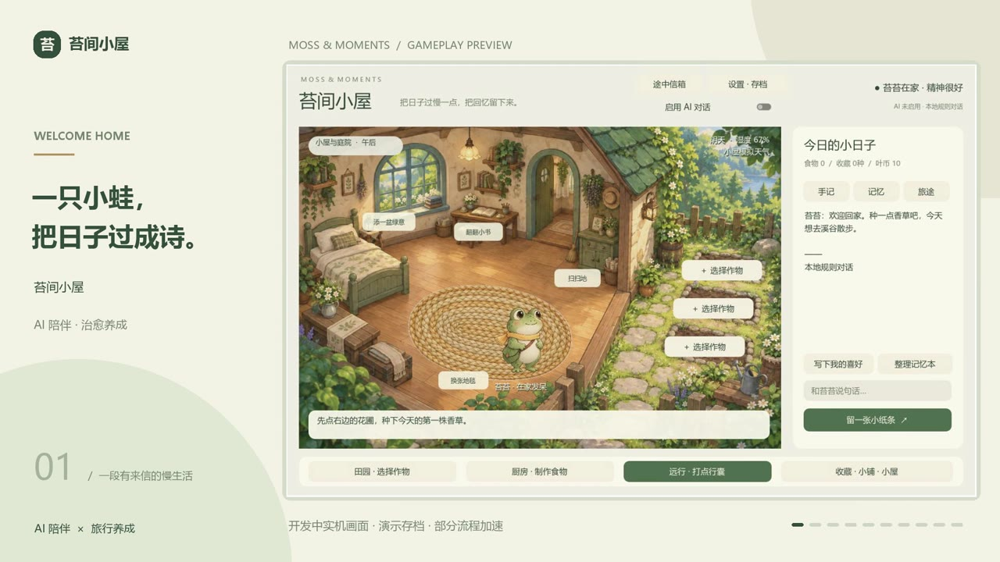
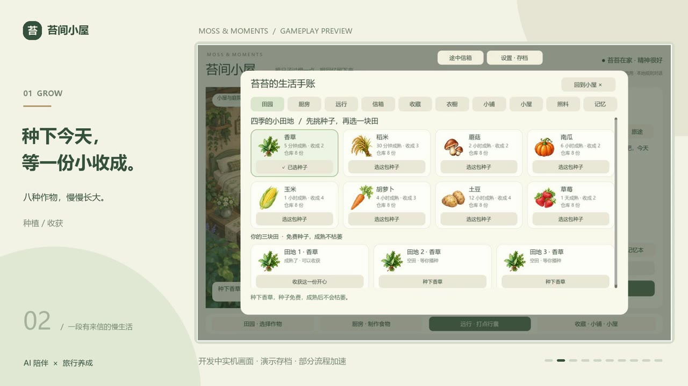
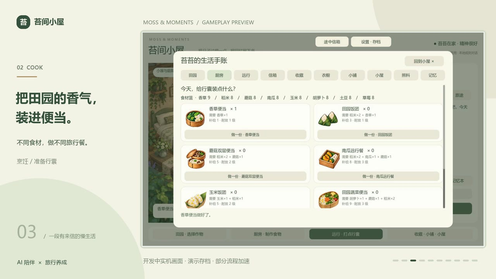
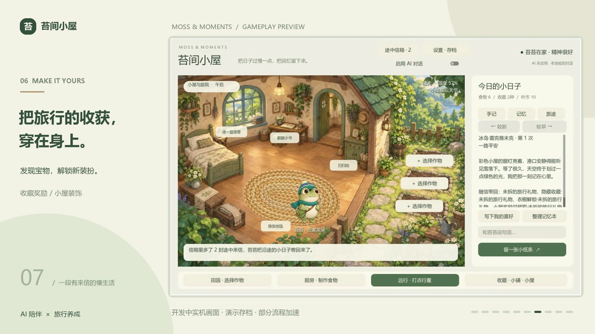
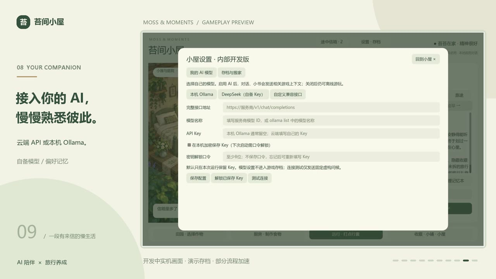

# 苔间小屋 · Moss & Moments

**种一点生活，等一封远方。**

一款用 Godot 制作的治愈系青蛙旅行养成游戏。种植作物、搭配便当，让小青蛙带着你的心意出发；在它回家之前，读一封沿途来信，翻翻小书，把小屋布置成喜欢的样子。也可以接入自己的 AI 模型，让日常对话多一些陪伴。



> 当前为持续开发中的 Windows 可玩原型。以下图片截自游戏宣传片，使用演示存档，部分流程加速；个别界面与最新版本略有差异。

## 在小屋里，慢慢过日子

### 种下今天，准备下一次远行

八种作物有各自的生长节奏。收获后制作便当，按份数自由搭配；备好适合路途的食物，再把青蛙送往远方。离线期间，作物和旅程仍会继续。




### 它还没回来，思念先到了

从附近溪谷到东京、伊斯坦布尔、巴黎和冰岛，九处目的地各有风景。归期藏在旅途里，沿途的城市会寄来明信片与小小问候。点开一张卡片，看看风景，也读读那一刻的心情。


### 把旅行的收获，留在身边

拆开旅行包裹，发现收藏与隐藏宝物。旅途收获能解锁青蛙装扮和小屋布置，旅册也会留下新的回忆。没有发现的惊喜，就让它继续藏一会儿。

回家后可以换地毯、摆盆栽、扫扫地、翻开每日小书，听着音乐看窗外的晴雨变化。



### 接入你自己的 AI

在「设置 · 存档 → 我的 AI 模型」里配置本机 Ollama、DeepSeek 或自定义兼容接口，支持获取模型列表和手动填写模型名称。对话、每日小书、旅行手记和途中信件可使用玩家选择的模型，失败时保留本地文本。接口可填写基础地址（如 `https://example.com/v1`，自动补全）或服务商提供的完整自定义路径。支持 Ollama 原生 `/api/chat` 和兼容接口。

**不内置共享 API Key。** 玩家填写自己的密钥；无需 AI 也能离线游玩。本机配置与游戏存档分开，密钥不随存档搬家。



## 下载与开始

进入 [G18 下载页面](https://github.com/MyLittleShrimp/Moss/releases/tag/g18)，选择对应的 Windows 压缩包：

| 版本 | 文件 | 适合谁 |
|---|---|---|
| 正式版 | [正式版下载](https://github.com/MyLittleShrimp/Moss/releases/download/g18/Moss-Release-G18-Audio-Windows.zip) | 想体验慢生活、保留探索惊喜的玩家 |
| 开发版 | [开发版下载](https://github.com/MyLittleShrimp/Moss/releases/download/g18/Moss-Development-G18-Audio-Windows.zip) | 想快速体验或帮助测试的玩家，含多档加速与机制说明 |

完整解压后，双击文件夹中的 `Start.cmd`。两个版本都包含音乐与音效，不用另外安装 Godot。更新前关闭旧窗口；保存生活可在设置中导出备份。

下载页附有 SHA-256 校验文件；源码也可以按下面的方法运行。

## 存档与搬家

游戏自动保存，也支持新建生活、另存副本、加载其他存档、JSON 导出与导入。换电脑时带上导出的游戏存档，在新设备重新配置自己的模型即可。目前没有云同步。

## 从源码运行

使用 **Godot 4.6.2** 打开 `project.godot`，运行主场景。Windows 也可以执行：

```powershell
./setup.ps1
./run.ps1
```

已有 Godot 时，可执行 `./run.ps1 -GodotPath '你的Godot控制台程序路径'`。引擎工具目录不随源码上传。

- `StartGame.cmd`：开发运行。
- `StartReleasePreview.cmd`：正式节奏预览。
- `tools/build.ps1 -Channel Release` / `Development`：构建对应便携包，需要本机工具和 Godot 导出模板。

## 当前边界

这是本地单人原型。G21 本地版本增加可选 AI 旅行手记与途中信件：阅读时请求，成功后保存，失败仍可读原始本地文本。离线每日小书包含按月日编排的 366 篇、1098 页，采用十二个月主题与三十一组故事结构组合，每年循环。旅册进展仍由本地规则决定。明信片插画仍是预生成资源；绘图设置仅预留接口，不发送请求。AI 文本不会直接发放物品或修改奖励。GitHub 当前 G18 下载包尚不包含 G21 功能。

小屋使用预设摆放位置；暂不支持全屋自由拖动、云存档或完整 Agent/MCP 接入。欢迎通过 Issues 反馈体验和问题，请不要贴出 API Key 或包含密钥的配置文件。

## 开发资料

- [当前开发状态](docs/STATUS.md)
- [阶段交接记录](docs/handoffs/)
- [问题与解决手册](docs/TROUBLESHOOTING.md)
- [素材来源记录](docs/ASSET_PROVENANCE.md)
- [GitHub 上传说明](docs/GITHUB_UPLOAD.md)

开发文档和源码包含机制细节，想保留探索惊喜的玩家可以先跳过。

项目尚未指定整体许可证；Godot 的许可证与第三方声明位于 [docs/third-party](docs/third-party/)。
